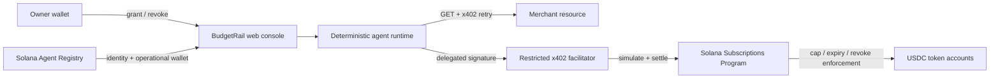
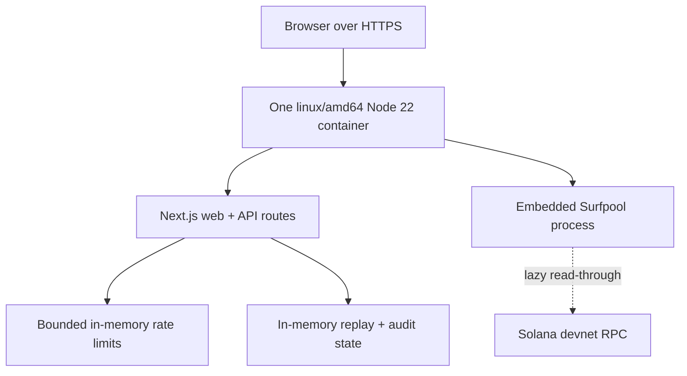

# BudgetRail architecture

Updated 2026-08-10 for the Phase 6 grant-demo release candidate and isolated Phase 7 mainnet canary.

## System shape

BudgetRail deliberately uses audited Solana primitives instead of a custom program. The native Subscriptions Program is the on-chain enforcement rail; x402 supplies the HTTP payment handshake; the Agent Registry binds the public identity to the operational wallet.

## Payment sequence

1. The merchant issues a one-time 0.10 USDC x402 challenge.
2. The deterministic policy compares the exact origin, CAIP-2 network, mint, recipient, fee payer, amount, and timeout with reviewed configuration.
3. The agent signs only the native `transferFixed` instruction. The LLM never builds or changes transaction fields.
4. The facilitator accepts only the Subscriptions Program as a top-level program, simulates, adds the fee-payer signature, and settles.
5. The merchant consumes the challenge and releases the resource only after successful settlement.
6. The console reconciles allowance and merchant balances and links every confirmed signature.

At disposable-rail creation, BudgetRail also runs and caches a native 3.00 USDC denial simulation. The interactive judge action combines that attestation with a fresh deterministic policy rejection and before/after balance reads. The standalone adversarial proof deliberately requests a second, fresh native simulation after the valid payment so the stronger post-payment invariant remains independently reproducible.

## Grant-demo deployment topology

The public grant demo must run as exactly one long-lived Linux x64 container. Serverless functions, Linux arm64, and multiple replicas are rejected by `/api/readiness` because Surfpool 1.4 publishes no Linux arm64 binary, while disposable signers, replay state, and the embedded runtime are process-local. This is a deliberate demo constraint, not a horizontally scalable production claim.

## Release boundaries

- Mainnet creation, payment, revocation, and demo writes remain disabled in the hosted application.
- `BUDGETRAIL_ENABLE_MAINNET_WRITES=true` is a tripwire that blocks readiness; it does not enable writes.
- A separate local CLI may execute only the fixed Phase 7 canary after a clean-commit check, private-RPC verification, exact-balance preflight, `--execute`, and the exact acknowledgement phrase.
- The canary is capped at 0.20 USDC and 0.05 combined SOL, uses disposable external keypairs, and closes delegated authority before funds are swept.
- No private key, seed phrase, funded mainnet signer, or authenticated RPC URL belongs in source or any `NEXT_PUBLIC_*` variable.
- Public actions have per-client quotas; the hosting proxy must overwrite client-IP headers.
- Hosted registry writes use the live same-origin agent card; local proofs use the stable repository metadata fallback.
- A future multi-replica service requires a durable transactional replay store, distributed rate limiting, and external signer custody before any production-money claim.

## Repository map

| Area                             | Responsibility                                                                          |
| -------------------------------- | --------------------------------------------------------------------------------------- |
| `packages/x402-adapter`          | exact requirement validation, delegated transfer, facilitator, merchant, and agent loop |
| `packages/agent-registry`        | ERC-8004 registration and operational-wallet verification                               |
| `packages/security`              | bounded error and diagnostic redaction                                                  |
| `packages/mainnet-canary`        | fixed mainnet policy, external evidence schema, and report rendering                    |
| `app/lib/phase3/demo-runtime.ts` | isolated disposable proof rail and activity state                                       |
| `app/lib/release/config.ts`      | fail-closed hosted-demo and mainnet release policy                                      |
| `app/lib/security/rate-limit.ts` | bounded public endpoint quotas                                                          |
| `scripts/phase*-*.ts`            | reproducible phase proofs and release gate                                              |
| `scripts/mainnet-canary.ts`      | isolated mainnet inspect, canary, verification, and recovery workflow                   |
